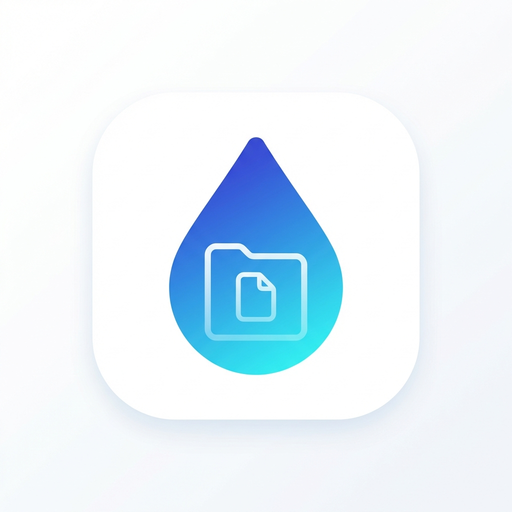

# SharedDrop

> Secure local file sharing via Cloudflare tunnel.

<p align="center">
  
</p>

## What is SharedDrop?

SharedDrop lets you share any folder from your computer with anyone, anywhere. No cloud storage, no file size limits — files stay on your machine until downloaded.

## Features

- 🔒 **Password Protected** — Every session gets a unique access code
- 🌐 **Cloudflare Tunnel** — Secure connection, no port forwarding needed
- 💬 **Real-time Chat** — Talk with connected guests
- 📁 **Browse & Preview** — Images, videos, and documents
- 📦 **Bulk Download** — Select multiple files as ZIP

## Quick Start

### Prerequisites

```bash
brew install cloudflared
```

### Install

Download the latest release from [Releases](../../releases):
- **macOS (Apple Silicon)**: `SharedDrop-x.x.x-arm64.dmg`
- **macOS (Intel)**: `SharedDrop-x.x.x.dmg`
- **Windows**: `SharedDrop Setup x.x.x.exe`

### Usage

1. Launch SharedDrop
2. Click **New Session** and select a folder
3. Share the URL and password with your guests
4. Click **Stop** when done

## Development

```bash
# Install dependencies
npm install

# Run in development mode
npm run dev

# Build for production
npm run dist:mac   # macOS
npm run dist:win   # Windows
```

## Tech Stack

- Electron
- React + TypeScript
- Vite
- Express + Socket.IO
- Cloudflare Tunnel
- SQLite (better-sqlite3)

## License

MIT

---

Built with ❤️ using Electron and Cloudflare.
